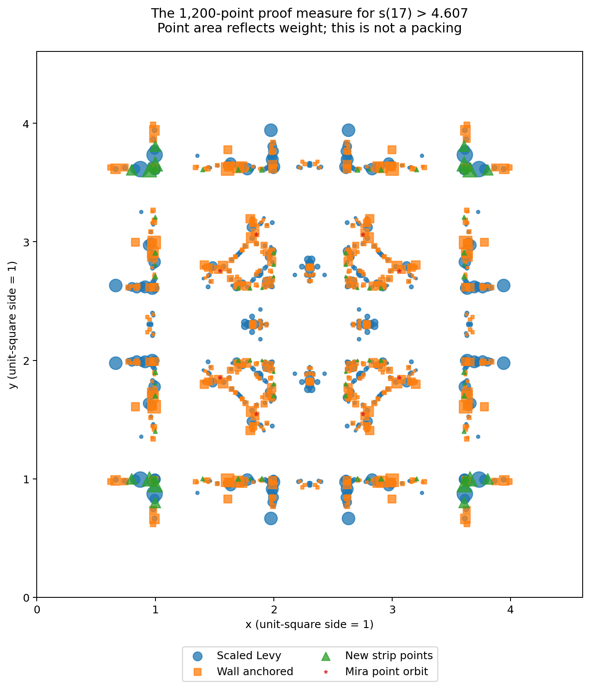

# A stronger exact lower bound for packing 17 unit squares

Prepared for Mira, 7 September 2026.

**Clean certificate:** `s(17) > 4.607`.

**Stronger strict decimal corollary:** `s(17) > 4.607028598640`.

**Strongest uniform-dilation corollary:**

    s(17) >= 4.6070285986402151094200443452332249826868248978648129218919134706...

The last displayed decimal is explanatory. The exact lower bound is
`sqrt(weak_endpoint_squared)` in [result.json](result.json), equivalently

    (4607/1000) * sqrt(1+h^2) / ((19997/20000)*(1+h)),
    h = 207107/1440000000.

The weak inequality at the radical endpoint is intentional. The strict decimal
bound is verified by squaring rational numbers, not by trusting printed digits.

## Exact certificate ledger

| Item | Value |
|---|---:|
| Containing side | 4607/1000 = 4.607 |
| Closed core side | 19997/20000 = 0.99985 |
| Distinct atoms | 1200 |
| Rational directions | 2881 |
| Total weight | 212283051/12500000 = 16.98264408 < 17 |
| Minimum core mass over every net direction and admissible centre | 1.00000116 > 1 |
| Centre slabs checked | 6,679,269 |

The arbitrary-orientation gaps are covered by a proved strict core-containment
inequality. Atom, cell and container boundaries are treated explicitly. This
is not a grid-sampling proof and does not assume squares are axis aligned.

## Replay

Requirements: Python 3 standard library, a C++17 compiler and Boost headers.
No optimizer, NumPy, SciPy, network connection, external certificate service,
or trusted prebuilt binary is required to verify the result.

```bash
python3 verify.py --direct
```

This rebuilds the checker, runs 13 positive/refusal controls for each
accumulation engine, independently replays the pinned Levy 4.59 source data,
replays the new 4.607 data, compares tree/prefix logs, and checks the exact
radical and strict-decimal corollaries against result.json. Rebuilt logs go
under `.replay/` by default.

The retained last line of either new-certificate log is:

```text
EXACT_CERTIFICATE_VALID atoms 1200 directions 2881 total_mass 1698264408/100000000 minimum 100000116/100000000 slabs 6679269
```

Both weight-accumulation engines use the same exact geometric partition.
Their agreement audits accumulation; it is not falsely described as two
independently authored geometric proofs. The full derivation is in
[PROOF.md](PROOF.md). External independent review is still welcome.

## Proof measure illustration



The plot is illustrative; the authoritative coordinates and weights are exact
rationals in best-certificate.json.

## A genuine contribution from the earlier Mira geometry

The final measure retains the eight-point D4 orbit from the older Mira point
`(1.494140, 2.660211)`, after scaling its 4.450837 container to 4.607. Each orbit
atom has weight 0.00429871, for total mass 0.03438968. Removing just this orbit
breaks the axis-aligned **core** coverage: the exact minimum becomes 0.99140418.
That ablation is in `audit/` and is deliberately NOT a valid lower-bound
certificate. It does not rule out reoptimizing another certificate without
these points.

The final per-family mass allocation is in best-certificate.json. The measure
also uses uniformly scaled Levy sites, wall-anchored copies, and near-unit-grid
strip additions. [RESEARCH.md](RESEARCH.md) explains the mechanism, failed
trials, and how the earlier full-pose proof infrastructure could be extended.

## Files and provenance

`best-certificate.json` is the final exact measure; `result.json` is its ledger.
`source/` contains the unchanged, byte-hash-matched Levy certificate.
`audit/` contains full logs and the negative ablation. `history/` preserves
intermediate exact bounds. `search/` contains untrusted discovery programs,
the final numerical warm start and its rational point dictionary.

The original data are credited to **Joshua Levy, the squares project** under
CC BY 4.0. The sixteen legacy point candidates come from **Mira**. See
[ATTRIBUTION.md](ATTRIBUTION.md). The weighted-cover principle and Levy's T-022
dilation lemma are not claimed as new; the stronger certificate is new to this
calculation.

## Continued discovery, separate from proof

Inside `search/`, compile the untrusted numerical oracle and install the
optional discovery dependencies listed in requirements-used.txt. For example:

```bash
cd search
g++ -O3 -std=c++17 -shared -fPIC numeric_sweep.cpp -o numeric_sweep.so
python3 build_dictionary.py 4.608 dictionary-trial.txt
ORBIT_FILE=dictionary-trial.txt FRESH=1 WARM=candidate_best.npz \
  python3 working_set_search.py 4.608 2880 0.99985
```

The 4.608 trial in this session did not produce a valid certificate; its
finite-row LP returned mass about 17.0076. This is not a proved global ceiling.
Every improved numerical candidate must be rationalized and fully replayed by
the exact checker before changing the theorem or its frontier entry.

## Repository integration

This package is integrated with the [technical paper](../../paper/main.tex),
[root verification guide](../../VERIFY.md), certificate result ledger and citation metadata.
`bash ./verify_all.sh` replays both weighted engines as well as the historical
checks. See [INTEGRATION.md](INTEGRATION.md) for the original patch's scope.
External peer review remains pending.
